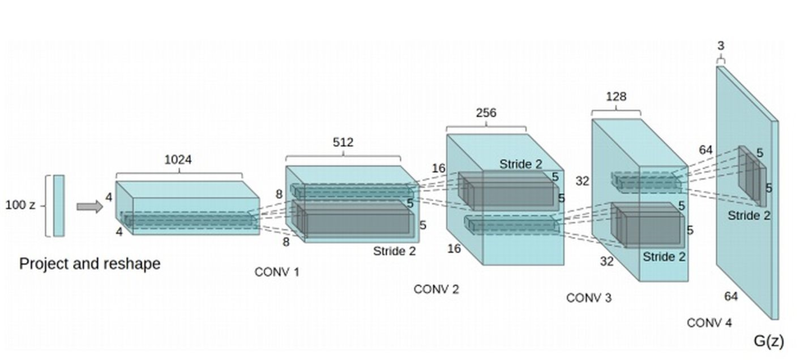
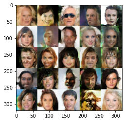

# DCGAN模型生成人脸模型

本项目用[DCGAN（Deep Convolution Generative Adversarial Nets）模型](https://arxiv.org/pdf/1511.06434.pdf)，在[CelebA人脸数据集](http://mmlab.ie.cuhk.edu.hk/projects/CelebA.html)上训练，使模型可生成新的人脸图像。

[DCGAN](https://arxiv.org/pdf/1511.06434.pdf)的生成器模型图示如下：




## 1、数据集处理

[CelebA人脸数据集](http://mmlab.ie.cuhk.edu.hk/projects/CelebA.html)包含202599张RGB图片。因为要生成人脸，所以先用截取出人脸的大致位置的区域，再resize到`64x64x3`，并对图像做归一化处理，使值在[-0.5, 0.5] 范围内。

本项目里的`utils.py`的`get_image()`函数，设置`face_width = face_height = 150`会使得截取到的人脸区域大概位置比较合适。


## 2、DCGANs训练的技巧
1. 建议每层都使用batched normalization批归一化

2. 建议使用Adam优化算法进行优化参数，学习率为0.0002而不是0.001。

3. 在生成器损失里，求Cross_entropy losses的时候，标签要使用相反的标签

   ```python
   # 判别器损失
   d_loss = cross_entropy(logits, labels)
   
   # 生成器损失
   # flipped_labels: 0 -> 1 、 1 -> 0
   g_loss = cross_entropy(logits, flipped_labels)
   ```

4. 对真实图片求判别器损失时，建议对标签进行平滑化（Labels moothing ）

   

以下是项目里的损失函数：


```python
#标签平滑化
smooth = 0.1
# 真实图片的判别器LOSS
d_real_loss = tf.reduce_mean(
                 tf.nn.sigmoid_cross_entropy_with_logits(logits = d_logits_real,
                                                         labels = tf.ones_like(d_out_real)*(1-smooth)))

# 生成图片的判别器LOSS
d_fake_loss = tf.reduce_mean(
                 tf.nn.sigmoid_cross_entropy_with_logits(logits = d_logits_fake,
                                                         labels = tf.zeros_like(d_out_fake)))

# 判别器LOSS：二者之和
d_loss = d_real_loss + d_fake_loss

#-----------------------    
   
# 生成器LOSS
g_loss = tf.reduce_mean(
                 tf.nn.sigmoid_cross_entropy_with_logits(logits = d_logits_fake,
                                                         labels = tf.ones_like(d_out_fake)))
```

   

## 3、训练效果

经过5个epoch后，效果如下图显示：



